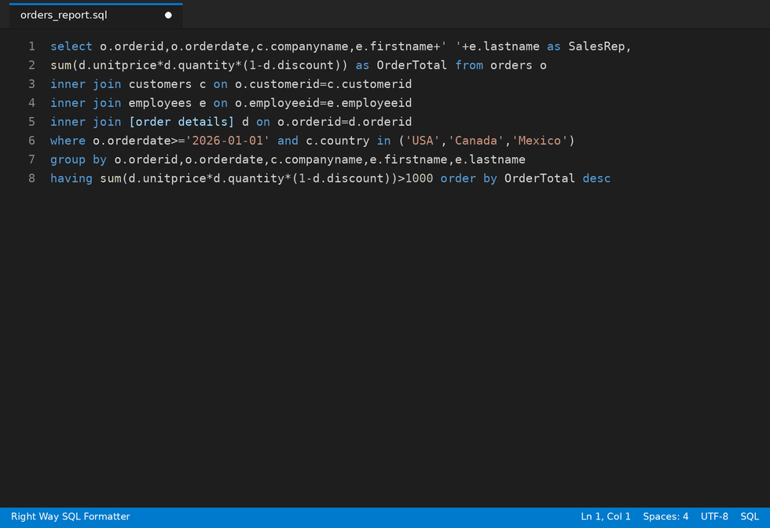
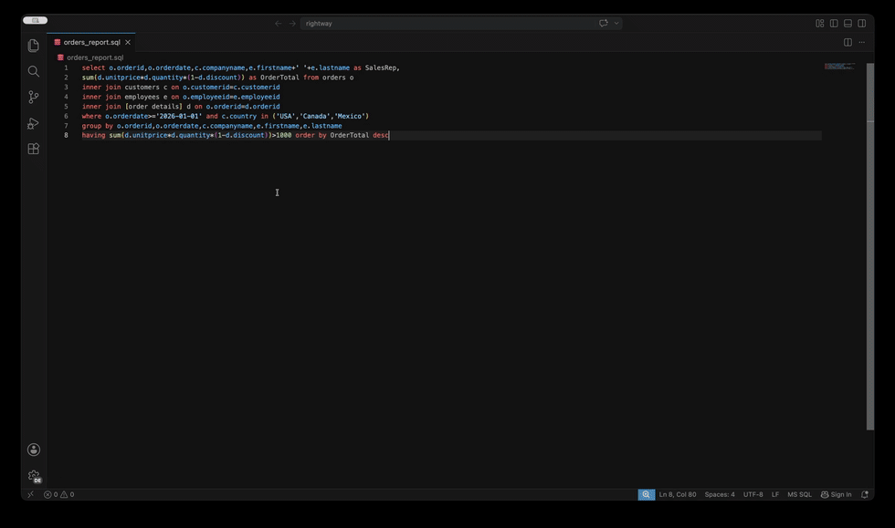

# Right Way SQL Formatter

[](https://marketplace.visualstudio.com/items?itemName=BadMonkeySoftware.right-way-sql-formatter)
[](https://marketplace.visualstudio.com/items?itemName=BadMonkeySoftware.right-way-sql-formatter)
[](https://marketplace.visualstudio.com/items?itemName=BadMonkeySoftware.right-way-sql-formatter&ssr=false#review-details)
[](https://github.com/BadMonkeySoftware/right-way-sql-formatter/blob/main/LICENSE.txt)

Format T-SQL in VS Code — the classic SSMS "Poor Man's T-SQL Formatter" style, modernized. Battle-tested against 396 real-world SQL files (First Responder Kit, Ola Hallengren, sp_WhoIsActive, DarlingData, tSQLt).



## Highlights

- **Native speed, zero dependencies** — formatting runs in a bundled native binary (win-x64/arm64, macOS x64/arm64, Linux x64/arm64). No .NET runtime, no language server, nothing to install.
- **Diff preview before you commit** — review proposed formatting in VS Code's built-in diff editor, then Apply or Discard.
- **Minimal edits** — only changed lines are touched: cursor position survives, undo is one clean step.
- **Never destroys invalid SQL** — unparseable input still gets best-effort formatting plus a diagnostic comment with line numbers, never a silent failure.
- **Your style, preserved** — both `expr AS alias` and `alias = expr` column alias styles are kept as you wrote them.
- **27 formatting options** — from classic SSMS defaults to trailing commas, vertical alignment of columns and JOINs, and compact single-statement blocks.

## Commands

| Command | Description |
|---|---|
| Right Way SQL: Format Document | Formats the entire active SQL file |
| Right Way SQL: Format Selection | Formats only the selected text |
| Right Way SQL: Format Document (Preview) | Opens a native diff (current ↔ formatted) with Apply/Discard |

All commands are available in the right-click context menu when editing a `.sql` file. The extension also registers as the document formatter for SQL, so `Format Document` (⇧⌥F / Shift+Alt+F) and format-on-save work too.

### Diff preview

`Format Document (Preview)` shows the proposed formatting in VS Code's built-in diff editor — green/red change highlighting, side-by-side or inline — before anything touches your file. Choose **Apply** to apply (formatting re-runs against the document's current text, so it's safe even if you kept typing), or **Discard** to close the preview unchanged.



### Minimal edits

Formatting is applied as line-level minimal edits (computed with an LCS diff) rather than replacing the whole document: cursor position survives, undo is a single clean step, and unchanged lines are untouched. Replacement text uses the document's own line endings.

### Invalid SQL

If the input can't be fully parsed, the formatter still produces best-effort output, prefixed with a comment describing what's wrong (with source line numbers — e.g. unclosed string literal, unexpected token), and the extension shows a warning toast. The underlying CLI signals this with exit code 5.

## Example

Input:
```sql
select e.employeeid,e.firstname,e.lastname,d.departmentname from employees e inner join departments d on e.departmentid=d.departmentid where e.active=1 order by e.lastname
```

Output (default settings):
```sql
SELECT
    e.EmployeeId
    ,e.FirstName
    ,e.LastName
    ,d.DepartmentName
FROM employees e
INNER JOIN departments d
    ON e.DepartmentId = d.DepartmentId
WHERE e.Active = 1
ORDER BY e.LastName
```

## Settings

All settings are under `rightWaySqlFormatter.*`:

### General

| Setting | Default | Description |
|---|---|---|
| `executablePath` | `""` | Explicit path to the SqlFormatter binary. Auto-detected (bundled binary, then PATH) if empty. |
| `indentString` | `"space"` | Indent character: `space` or `tab`. |
| `indentSize` | `4` | Spaces per indent level (or tab display width). |
| `maxLineWidth` | `999` | Max line width before wrapping. |
| `newStatementLineBreaks` | `2` | Blank lines between statements. |
| `newClauseLineBreaks` | `1` | Blank lines between clauses. |

### Keywords

| Setting | Default | Description |
|---|---|---|
| `uppercaseKeywords` | `true` | Uppercase SQL keywords. |
| `standardizeKeywords` | `true` | Normalize keyword synonyms (e.g. `NATIONAL CHARACTER VARYING` → `NVARCHAR`). |

### Expansion / line breaking

| Setting | Default | Description |
|---|---|---|
| `expandCommaLists` | `true` | Expand comma-separated lists onto separate lines. |
| `selectFirstColumnOnNewLine` | `false` | Break the first SELECT column to a new line instead of keeping it beside SELECT. |
| `expandInLists` | `true` | Expand `IN (...)` lists. |
| `trailingCommas` | `false` | Trailing commas instead of leading. |
| `expandBooleanExpressions` | `true` | Expand AND/OR onto separate lines. |
| `expandCaseStatements` | `true` | Expand CASE/WHEN/THEN/END. |
| `expandBetweenConditions` | `true` | Expand `BETWEEN ... AND ...`. |
| `breakJoinOnSections` | `false` | Break JOIN ON sections onto separate lines. |
| `indentJoinOnClause` | `false` | Indent the ON clause an extra level relative to JOIN. |
| `indentWhereAndOrConditions` | `false` | Put WHERE's AND/OR conditions on separate lines, aligned under the first condition. |

### Aliases and alignment

| Setting | Default | Description |
|---|---|---|
| `columnAliasStyle` | `"as"` | `as` (`col AS alias`) or `equals` (`alias = col`). Existing alias style is preserved either way. |
| `columnAlwaysHasAlias` | `false` | Ensure every SELECT column has an explicit alias. |
| `alignColumnDefinitions` | `false` | Align AS keywords vertically in the SELECT list (requires `expandCommaLists`). |
| `alignColumnDefinitionsInDDL` | `false` | In CREATE TABLE, align name / type / nullability / constraints into columns. |
| `ddlConstraintsOnNewLine` | `false` | In CREATE TABLE, each column constraint on its own line. |
| `alignTableJoins` | `false` | Align FROM/JOIN table names, aliases, and ON conditions vertically across a query batch. |
| `alignTableJoinsAddAliases` | `true` | With `alignTableJoins`: also add derived aliases to tables that have none. |

### Compactness

| Setting | Default | Description |
|---|---|---|
| `compactRaiserror` | `false` | Keep `RAISERROR(...)` argument lists on one line. |
| `compactSingleStatementBlocks` | `false` | Render single-statement IF/ELSE/WHILE bodies (no BEGIN/END) on the control keyword's line when short enough. |

## Development

The extension lives in `vscode-extension/` of the [main repo](https://github.com/BadMonkeySoftware/right-way-sql-formatter); formatting logic lives in the repo's .NET core library — no language server, no parsing in JS.

### Build

From the `vscode-extension/` directory:

```bash
npm install
npm run build:host   # fast dev loop: binary for this machine only + TypeScript
npm run build        # binaries for all six platforms + TypeScript
```

The build finds the .NET SDK automatically (checks `~/.dotnet`, system locations, then PATH) and publishes self-contained, trimmed `SqlFormatter` binaries into `vscode-extension/bin/<rid>/`. Supported platforms: win32-x64, win32-arm64, darwin-x64, darwin-arm64, linux-x64, linux-arm64. Set `RWSQL_NO_TRIM=1` to disable IL trimming when debugging the CLI.

### Run in dev mode

Open the **`vscode-extension/` folder** in VS Code (not the repo root — otherwise `F5` won't find the extension manifest), then press `F5` to launch an Extension Development Host. Open any `.sql` file there and right-click to format.

### Package

Marketplace releases are **platform-specific** — each user downloads only their platform's binary (~12 MB) instead of all six (~44 MB):

```bash
npm run package:all
# Produces: dist/right-way-sql-formatter-<target>-<version>.vsix (one per platform)

# Publish all of them:
npx vsce publish --packagePath dist/*.vsix
```

For a single universal .vsix (all platforms bundled, much larger — local installs only):

```bash
npm run package
# Produces: right-way-sql-formatter-<version>.vsix
```

Install a .vsix manually with:

```bash
code --install-extension <file>.vsix
```

## License

[AGPL-3.0-or-later](LICENSE.txt). Forked from Poor Man's T-SQL Formatter.
